```{=latex}
\begin{titlepage}
\thispagestyle{empty}
\centering
\vspace*{2.2cm}
{\LARGE\bfseries AA2 — Proyecto integrador\par}
\vspace{0.5cm}
{\Large Pipeline CI/CD para sistema de restaurante\par}
\vspace{2.4cm}
{\large David Alejandro Osorio Martínez\par}
\vspace{1cm}
{\normalsize Gestión del software\par}
{\normalsize Unidad 3 — Automatización y entrega continua\par}
\vfill
{\normalsize 21/05/2026\par}
\vspace{2.2cm}
\end{titlepage}
\clearpage
\setcounter{page}{1}
```

## Introducción

En este proyecto se diseñó y documentó un **pipeline de integración y entrega continua (CI/CD)** para el **sistema de gestión operativa de un restaurante**: la parte del software que usó el personal en sala y cocina para **administrar productos del menú**, **registrar pedidos** y **enviar comandas** al área de preparación (pantalla de cocina / KDS).

El alcance **no** incluyó reservas en línea ni pedidos desde la web del cliente; el enunciado del curso se tomó como referencia de negocio, y el pipeline se centró en el **flujo crítico de operación diaria** (donde un fallo en despliegue o en pruebas afectaba directamente el servicio).

Se justificó la automatización porque, sin pipeline, cada cambio dependía de pasos manuales (build, pruebas, subida al servidor), con riesgo de errores en producción y poca trazabilidad entre la versión desplegada y el commit probado.

## 1. Análisis del sistema

### 1.1 Funcionalidades principales (recorte documentado)

| Área | Qué hacía en operación |
|------|------------------------|
| **Productos / menú** | Alta y consulta de ítems que se vendían en sala (platos, bebidas, precios, agrupaciones). |
| **Toma de pedidos** | Captura del pedido en punto de venta: mesa, ítems, cantidades, formas de pago, cierre del documento de venta. |
| **Comandas a cocina** | Envío y seguimiento de ítems en pantalla de cocina (KDS): estados, prioridad por sección, coordinación con cocina. |
| **Soporte transversal** | Usuarios autenticados, inventario/bodega asociada al punto de venta, reportes de ventas del día. |

### 1.2 Módulos incluidos en el pipeline

Se definieron estos **módulos** como candidatos a validación automática en cada integración:

1. **Catálogo de productos** — APIs y reglas de negocio del menú.  
2. **Pedidos en sala** — creación y cierre de ventas desde el terminal táctil.  
3. **Comandas (KDS)** — flujo cocina: ítems pendientes, marcado de preparación/entrega.  
4. **Autenticación y permisos** — acceso de meseros y supervisores.  

El **front** (pantalla táctil en navegador) se desplegó por separado; el pipeline documentado se enfocó en el **backend**, donde se concentró la lógica y las pruebas automatizadas.

### 1.3 Puntos críticos que se automatizaron

- **Integración de código** en rama de despliegue sin merge manual al servidor.  
- **Pruebas unitarias** antes de empaquetar la imagen Docker.  
- **Construcción reproducible** de la imagen del servicio API.  
- **Publicación** en registro de contenedores con etiqueta por build.  
- **Despliegue** en entorno de pruebas/staging por SSH, con `docker compose pull` (sin rebuild en el servidor).  
- **Calidad estática** en integración continua (lint, formato, tipos).  
- **Notificación** al equipo cuando una etapa falló o terminó.

## 2. Diseño del pipeline CI/CD

### 2.1 Etapas principales

Se organizó el flujo en **dos canales** complementarios:

| Canal | Cuándo corría | Propósito |
|-------|----------------|-----------|
| **Integración continua (CI)** | En cada *push* y *pull request* | Pruebas rápidas y revisión de estilo de código. |
| **Entrega continua (CD)** | En la rama `deploy-pipeline` (Azure Pipelines) | Build de imagen, push al registry y despliegue a servidor de pruebas. |

**Secuencia del pipeline de despliegue (CD):**

```text
Checkout → Pruebas (pytest en Docker) → Limpieza → Build imagen → Push registry
    → Despliegue SSH (pull + compose up) → Notificación por correo
```

**Secuencia del pipeline de integración (CI en GitHub Actions):**

```text
Checkout → Build Docker → Job "test": migrate + pytest
    → Job "code-quality": flake8, black, isort, pylint, mypy
```

### 2.2 Herramientas por etapa

| Etapa | Herramienta |
|-------|-------------|
| Control de versiones | **Git** (repositorio del backend del restaurante) |
| Orquestación CD | **Azure Pipelines** (`azure-pipelines.yml`) |
| Orquestación CI | **GitHub Actions** (`.github/workflows/ci.yml`) |
| Contenedores | **Docker** + **Docker Compose** (`local.yml`, `testing.yml`) |
| Pruebas | **pytest**, **Django** migrate en entorno `test` |
| Calidad de código | **flake8**, **black**, **isort**, **pylint**, **mypy** |
| Registro de imágenes | **DigitalOcean Container Registry** |
| Despliegue remoto | **SSH** + script remoto de deploy + **docker compose** |
| Base de datos en pruebas | **PostgreSQL** (contenedor en CI) |

### 2.3 Diagrama del pipeline (despliegue)

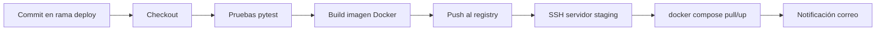

### 2.4 Ejemplo de configuración (fragmento YAML — CD)

El pipeline se definió en Azure DevOps. A continuación se muestra un fragmento **simplificado** (sin secretos):

```yaml
trigger:
  branches:
    include: [deploy-pipeline]

pool:
  vmImage: ubuntu-latest

variables:
  RUN_UNIT_TESTS: true
  DEPLOY_USE_REGISTRY_IMAGES: true

steps:
  - checkout: self

  - script: |
      # Pruebas: postgres + build django + pytest
      docker compose -f local.yml up -d postgres
      docker compose -f local.yml build django
      docker compose -f local.yml run --rm django bash -c "
        python manage.py migrate --settings=config.settings.test &&
        python -m pytest ewoa/ --create-db
      "
    displayName: "Pruebas unitarias"
    condition: ne(variables['RUN_UNIT_TESTS'], 'false')

  - script: |
      docker build -f compose/testing/django/Dockerfile -t REGISTRY/imagen:$(Build.BuildId) .
      docker push REGISTRY/imagen:$(Build.BuildId)
    displayName: "Build y push imagen"

  - script: |
      # SSH: pull de imagen y levantar servicios en servidor de pruebas
      bash scripts/deploy-remoto.sh
    displayName: "Despliegue staging"
```

### 2.5 Ejemplo de configuración (fragmento — CI en pull request)

```yaml
name: CI restaurante-backend
on: [push, pull_request]
jobs:
  test:
    runs-on: ubuntu-latest
    steps:
      - uses: actions/checkout@v4
      - run: docker compose -f local.yml up -d postgres
      - run: docker compose -f local.yml run --rm django pytest ewoa/
  code-quality:
    runs-on: ubuntu-latest
    steps:
      - uses: actions/checkout@v4
      - run: docker compose run --rm django flake8 ewoa/ config/
```

## 3. Ejecución del pipeline y evidencias

### 3.1 Escenario exitoso (referencia)

Se documentó el recorrido esperado cuando todas las etapas pasaban:

1. Un desarrollador subió cambios en el módulo de pedidos a la rama `deploy-pipeline`.  
2. Azure realizó el checkout del commit y levantó PostgreSQL en el agente.  
3. **Pruebas:** migraciones de test y `pytest` sobre el paquete de aplicación → resultado **exitoso** (`TESTS_RESULT=exitoso`).  
4. **Build:** `docker build` con Dockerfile de testing → imagen etiquetada con `Build.BuildId`.  
5. **Push:** imagen publicada en el registry (`BUILD_RESULT=exitoso`).  
6. **Deploy:** por SSH se copiaron manifiestos compose y script remoto; en el servidor se ejecutó `docker compose pull` y `up -d` del servicio API → `DEPLOY_RESULT=exitoso`.  
7. **Correo:** resumen con estado por etapa y enlace al build en Azure DevOps.

En staging, la API quedaba disponible con la nueva imagen; la pantalla táctil de sala podía tomar pedidos y enviar comandas si el front apuntaba a ese entorno.

### 3.2 Evidencias de ejecución

**Figura 1 — Vista del pipeline en Azure DevOps (ejecución global)**

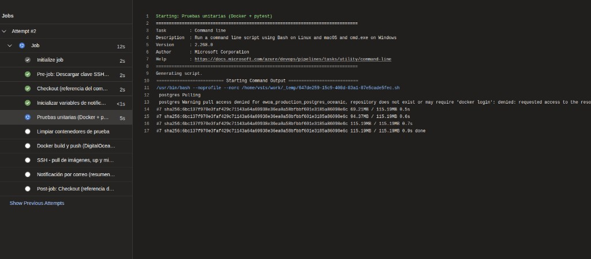

**Figura 2 — Checkout del commit en Azure (obtención del código)**

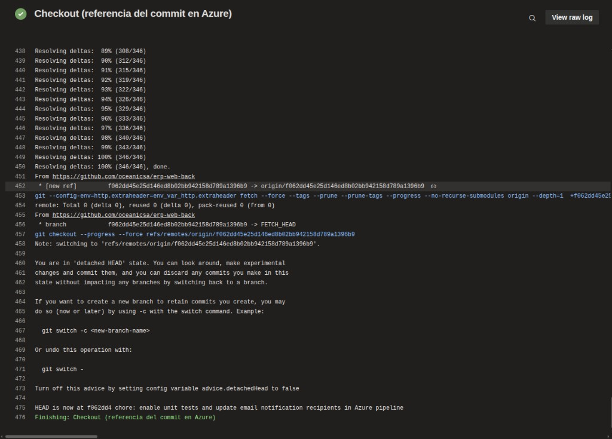

**Figura 3 — Etapa de pruebas unitarias (step completo: Docker + pytest)**

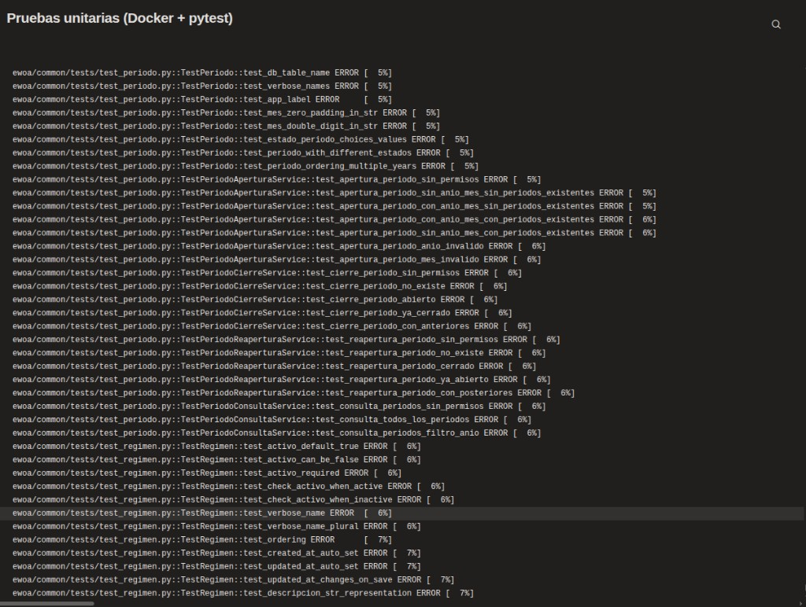

*El step terminó su ejecución; pytest reportó errores en la suite (el pipeline marcó la etapa como fallida y no continuó con build ni despliegue).*

**Figura 4 — Verificación de build del front (GitHub Actions: step “Build project”)**

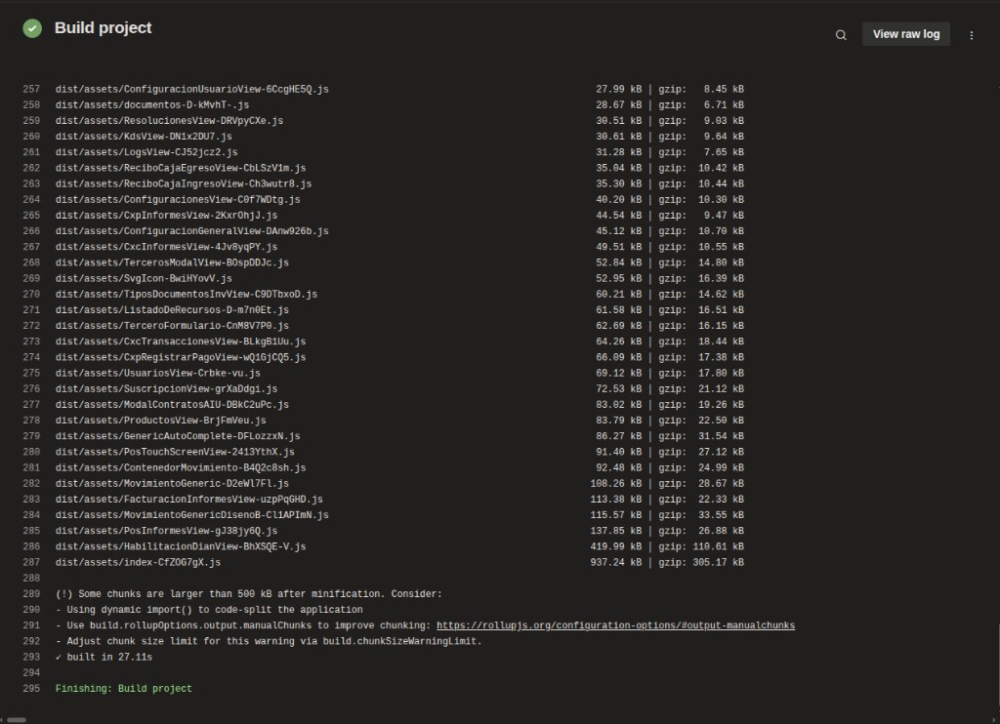

*Se compiló con Vite (`built in 27.11s`); el bundle incluyó módulos de productos, POS e informes. En el pipeline de despliegue del backend, la etapa equivalente fue **docker build + push** al registry.*

### 3.2.1 Pasos en el front (punto de venta y cocina)

Se registró el flujo operativo que consumió el backend desplegado por el pipeline:

| Paso | Acción | Módulo |
|------|--------|--------|
| 1 | Selección de mesa o zona en sala | Pedidos |
| 2 | Búsqueda de productos, armado del carrito y datos del documento | Productos + pedidos |
| 3 | Cobro (formas de pago, propina, confirmación) | Pedidos |
| 4 | Comanda en cocina — estado **Pendiente** (botón *Comandar* / KDS) | Comandas |
| 5 | Seguimiento en KDS — estado **Preparada** y cierre (*Completar*) | Comandas |

**Figura 5 — Paso 1: selección de mesa**

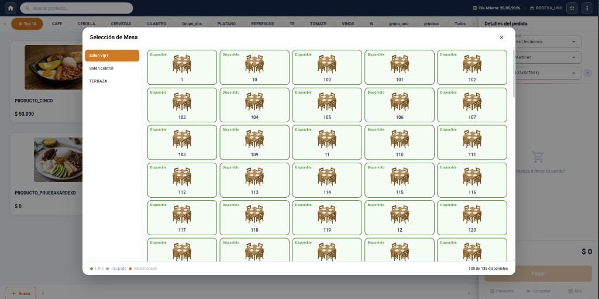

**Figura 6 — Paso 2: toma de pedido (productos en carrito)**

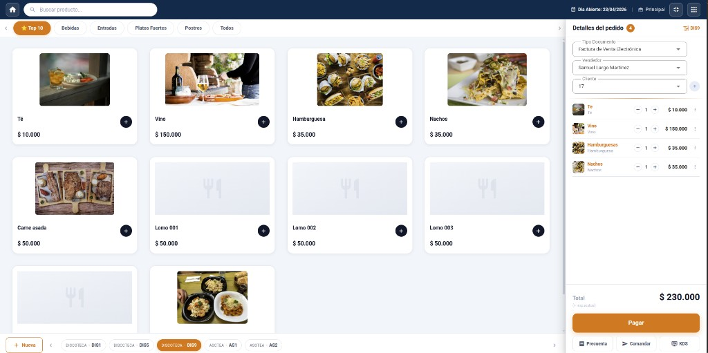

**Figura 7 — Paso 3: procesar pago**

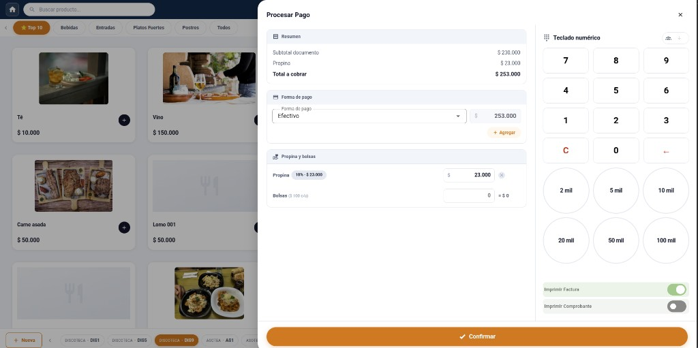

**Figura 8 — Paso 4: comanda en cocina (KDS — pendiente)**

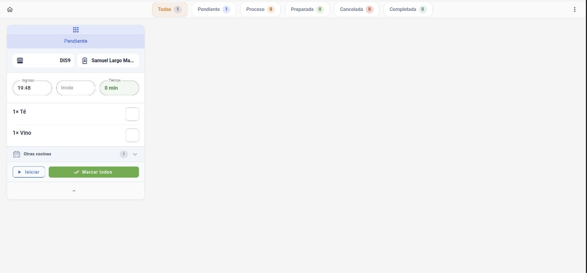

**Figura 9 — Paso 5: comanda preparada (KDS)**

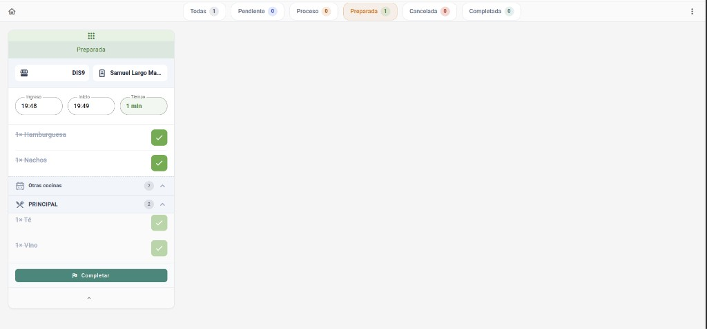

**Figura 10 — Integración continua en GitHub Actions (workflow `lint.yml` en pull request)**

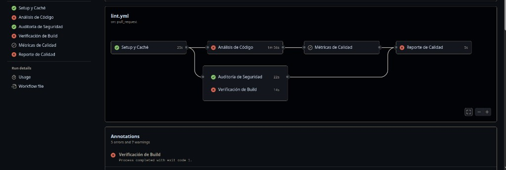

*Los jobs de análisis de código y verificación de build fallaron en la corrida capturada; el pipeline detuvo el reporte final (gate de calidad antes de desplegar).*

### 3.3 Fallo observado en ejecución real y corrección

**Evidencia (Figura 3):** en una corrida del pipeline, el step de **pytest** finalizó con múltiples **ERROR** en tests de módulos transversales; la etapa quedó en fallo.

| Etapa | Resultado |
|-------|-----------|
| Pruebas unitarias | **Fallido** |
| Build imagen | **Omitido** (no corrió al fallar las pruebas) |
| Despliegue | **Omitido** |
| Correo | Asunto con etiqueta **FALLIDO** y detalle `Pruebas unitarias [FALLO]` |

**Medidas de corrección que se propusieron:**

1. Revisar el log de pytest en Azure y localizar el test roto.  
2. Corregir la regla de negocio o el test; ejecutar `docker compose run django pytest` en local.  
3. Abrir un PR y esperar **GitHub Actions** en verde (CI).  
4. Fusionar y relanzar el pipeline de despliegue hasta obtener el step de pruebas en verde.

### 3.4 Comandos de consola (referencia local)

```bash
# Entorno de prueba local (mismo criterio que el pipeline)
docker compose -f local.yml up -d postgres
docker compose -f local.yml build django
docker compose -f local.yml run --rm django bash -c \
  "python manage.py migrate --settings=config.settings.test && python -m pytest ewoa/pos/ -v"
```

## 4. Validación de calidad y seguridad

En el pipeline se contemplaron requisitos **no funcionales** de la siguiente manera:

| Requisito | Cómo se validó en el pipeline |
|-----------|-------------------------------|
| **Calidad de código** | Job de flake8, black, isort, pylint, mypy en CI. |
| **Confiabilidad funcional** | pytest con base de datos de prueba aislada. |
| **Reproducibilidad del despliegue** | Imagen Docker versionada por `Build.BuildId`; el servidor solo hizo pull. |
| **Disponibilidad del despliegue** | Script remoto con healthcheck implícito vía compose; reintento manual documentado. |
| **Seguridad operativa** | Clave SSH en *Secure Files* de Azure; token de registry como secreto; sin build en producción. |

**Dos técnicas/herramientas que se integraron:**

1. **Análisis estático de código** — pylint + flake8 en el job `code-quality`.  
2. **Pruebas automatizadas de regresión** — pytest sobre módulos de pedidos, POS y comandas antes de permitir el build.

*(El escaneo de vulnerabilidades en imagen, por ejemplo Trivy, quedó registrado como mejora futura.)*

## 5. Buenas prácticas y escalado

**Buenas prácticas que se aplicaron o documentaron:**

- Integración en rama dedicada antes de producción.  
- Pruebas automáticas como *gate* antes del build.  
- Imagen inmutable por build (sin “git pull + build” en el servidor).  
- Separación CI (cada PR) frente a CD (rama de despliegue).  
- Notificación al equipo al finalizar el pipeline.  
- Limpieza de contenedores de prueba (`docker compose down`) aunque fallara un paso intermedio.

**Escalado que se sugirió:**

- Añadir **entorno de producción** con aprobación manual (*approval gate*) en Azure.  
- Desplegar el **front** en CDN o bucket estático en un job paralelo.  
- Incorporar **Trivy** o similar en la etapa de build para vulnerabilidades.  
- Pruebas de **carga** ligeras en staging tras el deploy (módulo de pedidos en hora pico simulada).  
- **Blue/green** o rolling update si el restaurante escaló a varias sucursales.

## Conclusiones

Se documentó un pipeline **CI/CD** para el backend del sistema operativo del restaurante: automatizó pruebas, empaquetado y despliegue a staging, alineado con prácticas DevOps del curso. La relación con la **calidad del producto** fue directa: un pedido mal validado o un deploy roto se detectó **antes** de que el personal de sala lo sufriera en producción.

**Aprendizajes obtenidos:** (1) CI y CD cumplieron roles distintos pero complementarios; (2) Docker y el registry permitieron despliegues repetibles; (3) fallar las pruebas temprano evitó incidentes en cocina y caja; (4) documentar variables y secretos del pipeline formó parte del mantenimiento del sistema.

---

## Referencias

- Documentación Azure Pipelines — YAML schema y tasks.  
- Docker Compose — orquestación local y remota.  
- pytest — pruebas automatizadas en Python/Django.
