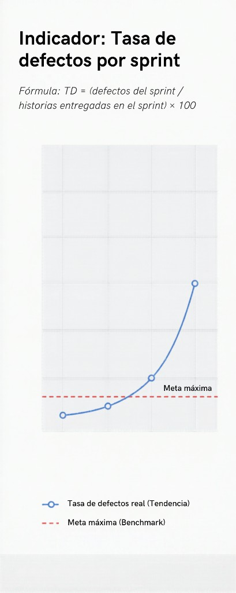
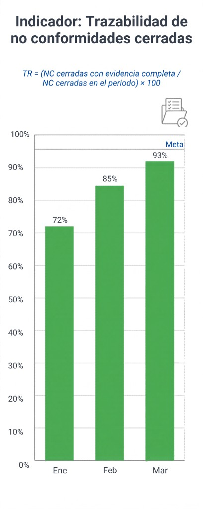
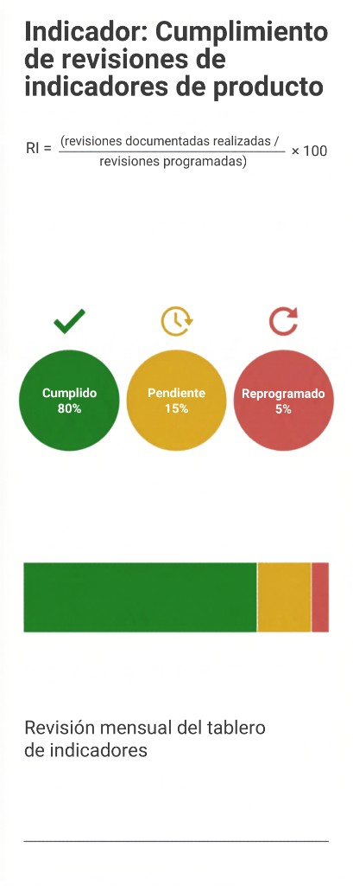

```{=latex}
\begin{titlepage}
\thispagestyle{empty}
\centering
\vspace*{2.2cm}
{\LARGE\bfseries Estudio de caso:\\[0.35em]Auditoría de calidad e indicadores\par}
\vspace{2.8cm}
{\large David Alejandro Osorio Martínez\par}
\vspace{1.1cm}
{\normalsize Prueba y calidad de software\par}
\vfill
{\normalsize 13/05/2026\par}
\vspace{2.2cm}
\end{titlepage}
\clearpage
\setcounter{page}{1}
```

## 1. Contexto resumido

En este trabajo se analizó el caso de **SoftNova S.A.S.**, empresa contratada para implementar un sistema de gestión de calidad basado en **ISO 9001:2015**. Durante una **auditoría interna** se detectaron debilidades: **no quedaron claros los responsables** de varios procesos, **no se le dio seguimiento suficiente** a los indicadores de producto, **la trazabilidad de las no conformidades (NC) era baja**, en los **últimos tres sprints se duplicó la tasa de defectos** y **no había registros documentados** de acciones correctivas. A partir de esa situación se elaboró el análisis que sigue.

## 2. Tipos de auditoría aplicables y justificación

Se **clasificaron** los tipos de auditoría aplicables al caso (norma ISO 9001:2015 y práctica de SGQ).

| Tipo | ¿Aplica? | Justificación breve |
|------|----------|---------------------|
| **Interna** | Sí (central) | El caso describe una auditoría **interna** de la organización frente a ISO 9001 (cláusula 9.2). |
| **Externa (2.ª parte)** | Sí (potencial) | Un **cliente** u otra parte interesada puede auditar el control de calidad del software entregado. |
| **De certificación** | Sí (contexto) | Un organismo acreditado audita **certificación** o **renovación** si SoftNova certifica el SGQ. |
| **Seguimiento / vigilancia** | Sí (post-certificación) | Auditorías **periódicas** para comprobar que el sistema se mantiene tras cerrar NC. |

El caso **partió** de la **interna**; las demás categorías aplican según la etapa del SGQ (brechas, expectativas del cliente, formalización normativa, cierre del ciclo).

## 3. Métodos de validación (al menos tres)

Se **identificaron** tres métodos de validación, con **ejemplos** alineados al caso:

1. **Revisión documentada** — revisar procedimientos, RACI, registros de NC y evidencias de acciones correctivas; ejemplo: **muestreo de tres sprints** y comprobar causa, acción y responsable por NC.  
2. **Entrevistas estructuradas** — validar roles y comprensión del SGQ; ejemplo: **líder de calidad** y **dos desarrolladores** con guion ISO 9001:2015.  
3. **Muestreo de registros y datos** — comprobar que los indicadores existan y se calculen igual en el tiempo; ejemplo: cruzar **tasa de defectos** por sprint con tablero e incidencias.

## 4. No conformidades y plan de mejora (ciclo **PDCA**)

Se **resumieron** las NC implícitas en el caso: responsables poco claros; indicadores de producto **sin** seguimiento sistemático; trazabilidad débil de NC; aumento fuerte de defectos; acciones correctivas **sin** registro documentado.

Con base en eso se **armó** un plan de mejora alineado con **PDCA**, con acciones concretas y responsables sugeridos:

| Fase | Acciones | Responsable |
|------|----------|-------------|
| **Planificar** | RACI del SGQ; plantilla única de NC; meta de defectos por sprint; calendario de revisión de indicadores. | Calidad + PM |
| **Hacer** | Capacitación en plantilla y tablero; pilotaje un sprint; NC y acciones en una sola herramienta (p. ej. Jira). | Líder de calidad + equipos |
| **Verificar** | Auditoría interna a 30 días; 100 % NC del piloto con trazabilidad; comparar defectos vs. línea base. | Auditor interno |
| **Actuar** | Estandarizar lo que funcionó; actualizar manual del SGQ; si no hay meta, mejora a pruebas o CI. | Comité de calidad |

También se planteó enfoque **preventivo**: riesgos antes de cada sprint y umbral de alerta en defectos.

## 5. Tres indicadores clave de calidad del producto

Se **diseñaron** tres indicadores (fórmula, responsable, figura ilustrativa). La figura 2 se **actualizó** para alinear porcentajes con las barras.

**Indicador 1 — TD** — TD = (defectos del sprint ÷ historias entregadas en el sprint) × 100. Responsable: líder de calidad.



**Indicador 2 — TR** — TR = (NC cerradas con evidencia completa ÷ NC cerradas en el periodo) × 100. Responsable: oficial de calidad.



**Indicador 3 — RI** — RI = (revisiones documentadas ÷ revisiones programadas) × 100. Responsable: PM + calidad.



## 6. Informe ejecutivo — conclusiones y recomendaciones

**Conclusiones.** El análisis mostró un SGQ alineado **en papel** con ISO 9001, pero **flojo en ejecución**: poca trazabilidad de NC, indicadores sin gobierno y defectos crecientes sin acciones correctivas documentadas.

**Recomendaciones:** (1) trazabilidad de NC y acciones como **requisito de cierre**; (2) revisión periódica de los tres indicadores en dirección o comité de calidad; (3) auditoría interna de **seguimiento** post-piloto y evidencia para auditoría externa; (4) alinear indicadores con la **práctica real** de desarrollo (historias y causa raíz).

## Referencias

ISO 9001:2015; guías de auditoría de sistemas de gestión (procesos y evidencias).
