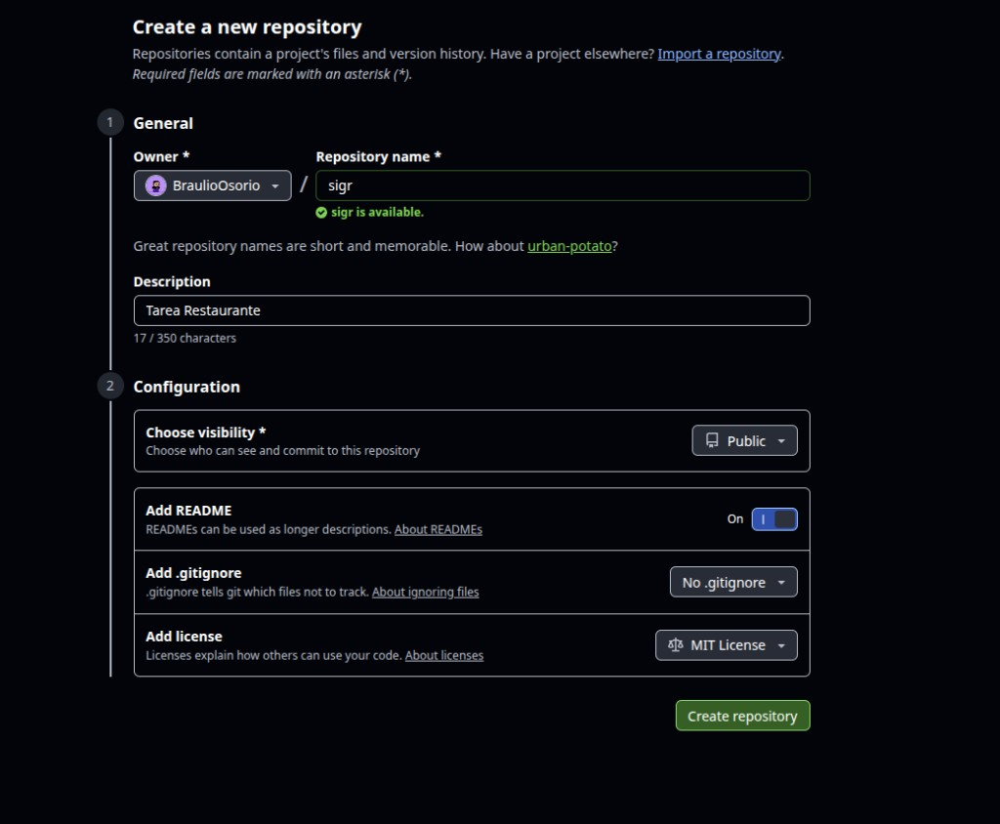
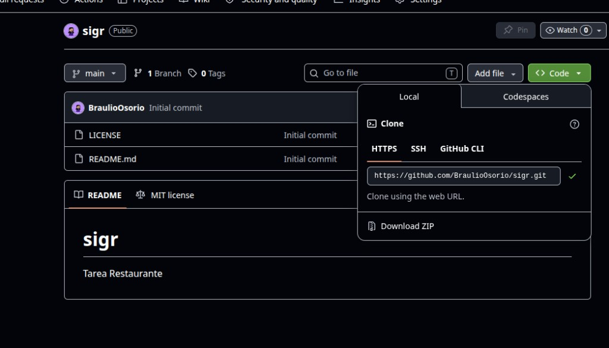
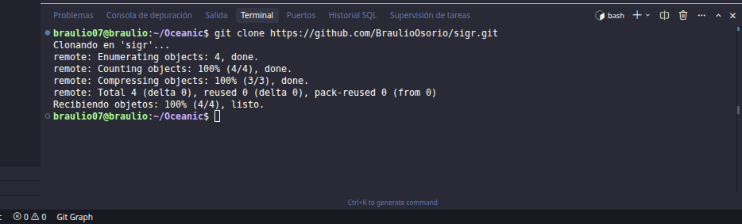
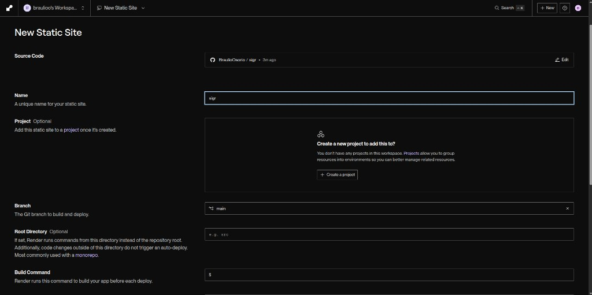
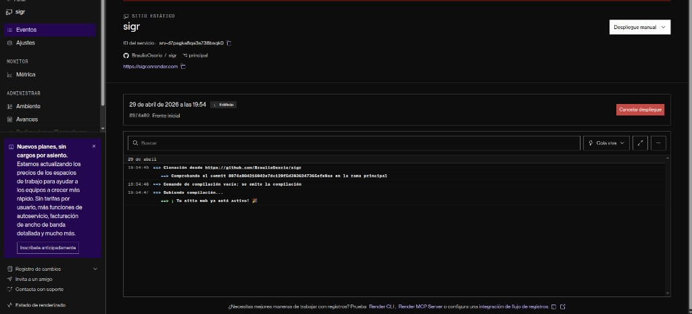

# AA2 — Línea base software de restaurante (SIGR)

> **Uso del documento:** borrador para generar el PDF `Taller_LineaBase_SIGR.pdf` (Pandoc, Word o imprimir desde el visor). Imágenes en `docs/assets/`. En el programa la actividad puede figurar como “Taller grupal”; este entregable corresponde a **un integrante** y cita los **elementos del enunciado AA2** (secciones 1 a 4.7) para alinear con la rúbrica.

---

## 1. Portada *(reproducir en la primera página del PDF con formato de portada)*

| Campo | Contenido |
|--------|-----------|
| **Título del taller** | AA2 — Línea base software de restaurante (SIGR) |
| **Integrante** | David Alejandro Osorio Martínez |
| **Nombre del curso** | Gestión del software |
| **Programa** | Ingeniería de software |
| **Unidad** | 2 — Gestión de la configuración |
| **Actividad** | AA2 |
| **Fecha de entrega** | 30/04/2026 |
| **Tutor** | Carlos Carrascal Avendaño |

---

## 2. Introducción

El **Sistema integral de gestión de restaurante (SIGR)** es una aplicación web orientada a la operativa del negocio: pedidos, reservas, menús, usuarios, reportes y facturación. En etapas tempranas del desarrollo, fijar una **línea base** del código fuente permite marcar un hito estable: a partir de ese punto se controlan los cambios, se gana **trazabilidad** y se evita que el producto avance sin un referente claro frente a la asignatura y los siguientes entregables.

---

## 3. Objetivo del taller

Documentar el **primer hito de estabilidad** del SIGR en términos funcionales y técnicos, aplicando **gestión de configuración** y **control de versiones** con Git y GitHub. Se consolida la **documentación técnica** (README, despliegue, datos, changelog) como base para versiones y cambios posteriores.

---

## 4. Contenido técnico

### 4.1. Descripción del proyecto

- **Nombre del sistema:** SIGR — Sistema integral de gestión de restaurante.
- **Descripción breve:** aplicación web para gestionar pedidos, reservas, administración de menús, control de caja y generación de reportes. En esta línea base el alcance **implementado** es un prototipo de pedidos en cliente; el resto del alcance funcional queda definido para evolución futura.

### 4.2. Componentes incluidos en la línea base

**Incluidos en el código y la documentación de este hito**

- **Pedidos (prototipo):** aplicación estática en `front/` (HTML, CSS, JavaScript): menú por categorías, búsqueda, carrito en modal, checkout (mesa o domicilio), resumen y persistencia en `localStorage`. Despliegue público en Render: [https://sigr.onrender.com/](https://sigr.onrender.com/).

**Definidos como alcance del SIGR para fases posteriores** *(no implementados en esta línea base)*

- Módulo de **autenticación** de usuarios (clientes, meseros, administrador).
- Módulo de **menú digital** con CRUD de platos y categorías en servidor.
- Módulo de **registro y seguimiento de pedidos** con backend y tiempo real.
- Módulo de **reservas** por fecha y hora.
- Módulo de **cierre de caja** y **reportes** de ventas diarios.

### 4.3. Versionado del código

| Concepto | Valor |
|----------|--------|
| **Herramienta** | Git |
| **Repositorio oficial** | https://github.com/BraulioOsorio/sigr |
| **Rama principal estable** | `main` |
| **Commit inicial** | `01e971a72995c86a5dd03305efe145d91d26593f` — *Initial commit* |
| **Documentación e imágenes del taller** | `77c01bcecff75bd7680eed7225e7605866674b06` — *Documentacion inicial* |
| **Front de pedidos y README** | `8974a804216942e7dc129f5d3936247365efe9ae` — *Front inicial* |
| **Documentación AA2 y despliegue** | Serie de commits hasta el **HEAD** de `main` (p. ej. inclusión de Render, `CHANGELOG`, ajustes del informe); comprobar con `git log -1 --oneline` en el clon actualizado. |

La línea base abarca el historial desde el commit inicial hasta el **HEAD** actual de `main` en GitHub.

#### 4.3.1. Creación del repositorio en GitHub

Se creó el repositorio público **`sigr`** bajo el usuario **BraulioOsorio**, con descripción *Tarea Restaurante*, **README** inicial y licencia **MIT**.



#### 4.3.2. URL HTTPS para clonar

Pestaña *Code*, método **HTTPS**: `https://github.com/BraulioOsorio/sigr.git`.



#### 4.3.3. Clonado en el equipo local

Ejemplo de clonado en el equipo de trabajo (directorio base `~/Oceanic`):

```bash
git clone https://github.com/BraulioOsorio/sigr.git
```



Pasos resumidos: instalar Git → terminal en la carpeta deseada → `git clone` con la URL HTTPS → `cd sigr` → comprobar con `git status` y `git log`.

#### 4.3.4. Registro de cambios en el remoto

Ejemplo de flujo usado al incorporar `docs/` y subir al remoto:

1. `git status` — comprobar rama `main` y archivos sin seguimiento.
2. `git add .` — preparar cambios.
3. `git commit -m "Documentacion inicial"` — commit `77c01bc…` con capturas en `docs/assets/`.
4. `git push` — sincronizar con `origin/main`.

#### 4.3.5. Despliegue público (Render)

Sitio estático con URL: **[https://sigr.onrender.com/](https://sigr.onrender.com/)**

Repositorio: `BraulioOsorio/sigr`, rama `main`. **Root directory:** `front` (para servir `index.html`, `styles.css` y `script.js` en la raíz del sitio).





### 4.4. Criterios para establecer la línea base

- **Front operativo:** el contenido de `front/` se ejecuta en local (p. ej. `python3 -m http.server` dentro de `front/`) y en **producción** en Render, con recorrido manual comprobado: menú, filtros, carrito, checkout y resumen.
- **Compilación / build:** no aplica pipeline de compilación: el entregable es **HTML, CSS y JS estático**; la “compilación” del hito se entiende como conjunto de archivos coherentes y servibles sin errores.
- **Estructura del repositorio:** `docs/` (informe, `DEPLOY`, `DATABASE`, `assets/`), `front/` (aplicación), raíz con `README.md`, `LICENSE`, `LICENSE.txt`, `CHANGELOG.md`.
- **Documentación mínima:** `README.md` (clonar, ejecutar, estructura), `docs/DEPLOY.md` (local y Render), `docs/DATABASE.md` (`localStorage` y modelo futuro), `CHANGELOG.md` (historial hasta la versión documentada).

### 4.5. Herramientas de soporte

| Herramienta | Uso en esta línea base |
|-------------|-------------------------|
| **Git** | Control de versiones local; commits y rama `main`. |
| **GitHub** | Repositorio remoto `BraulioOsorio/sigr`, clonado y `push` documentados. |
| **Render** | Sitio estático público del front: [https://sigr.onrender.com/](https://sigr.onrender.com/). |
| **GitHub Issues** | No activado en este hito; queda disponible para seguimiento de mejoras e incidencias en iteraciones posteriores. |
| **Jenkins** | No utilizado en esta línea base *(opcional según guía docente; reservado para integración continua futura)*. |

### 4.6. Documentación asociada

| Artefacto | Estado |
|-----------|--------|
| `README.md` | Incluido — clonado, estructura, ejecución del front, URL Render, créditos de imágenes. |
| `CHANGELOG.md` | Incluido — historial hasta la línea base `0.1.0` y commits relevantes. |
| `LICENSE` y `LICENSE.txt` | MIT — mismo texto. |
| `docs/DEPLOY.md` | Despliegue local y Render. |
| `docs/DATABASE.md` | Persistencia actual y entidades previstas. |

### 4.7. Validación y aprobación de la línea base

| Campo | Valor |
|--------|--------|
| **Fecha de creación de la línea base documentada** | 30/04/2026 |
| **Validado por** | David Alejandro Osorio Martínez |
| **Responsable de aprobación del entregable** | David Alejandro Osorio Martínez *(actividad presentada de forma individual)* |

---

## Referencias de archivos en este entregable

- Informe: `docs/Taller_LineaBase_SIGR.md`
- Imágenes: `docs/assets/01-creacion-repositorio-github.png` … `05-render-deploy-live.png`
- `CHANGELOG.md`, `docs/DEPLOY.md`, `docs/DATABASE.md`
