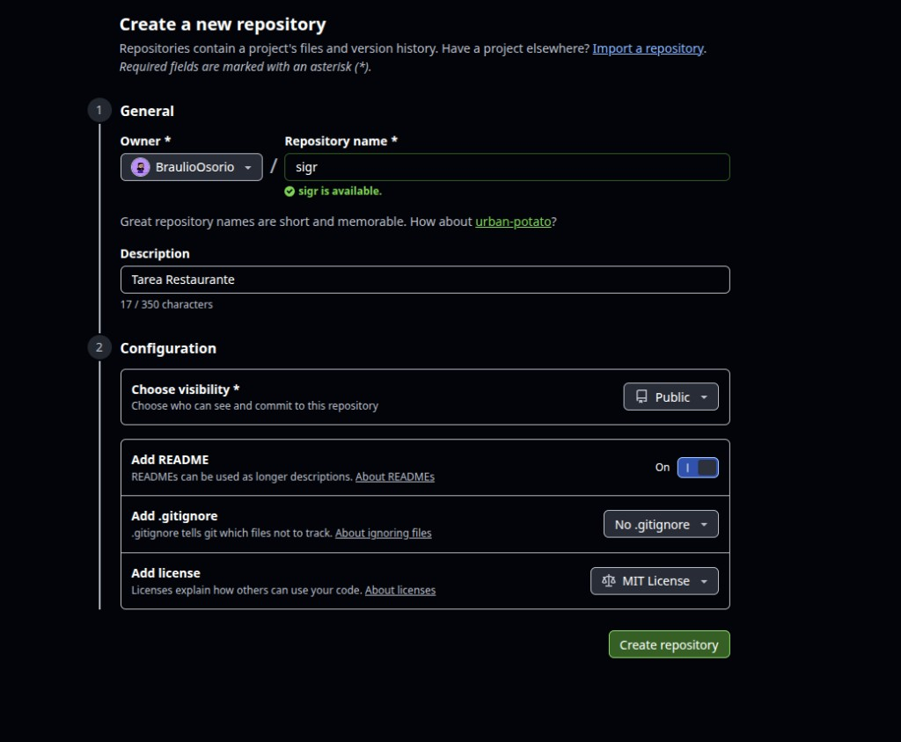
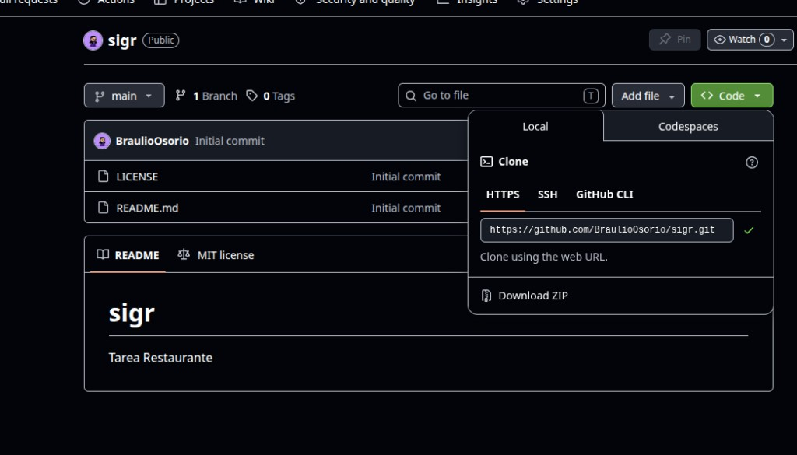
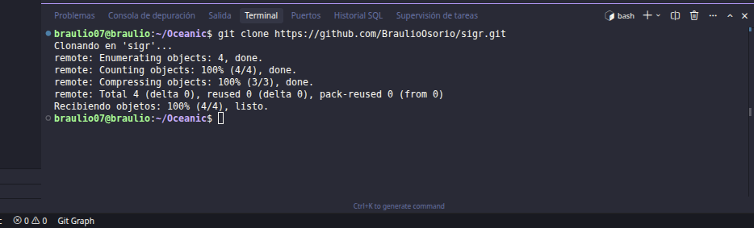
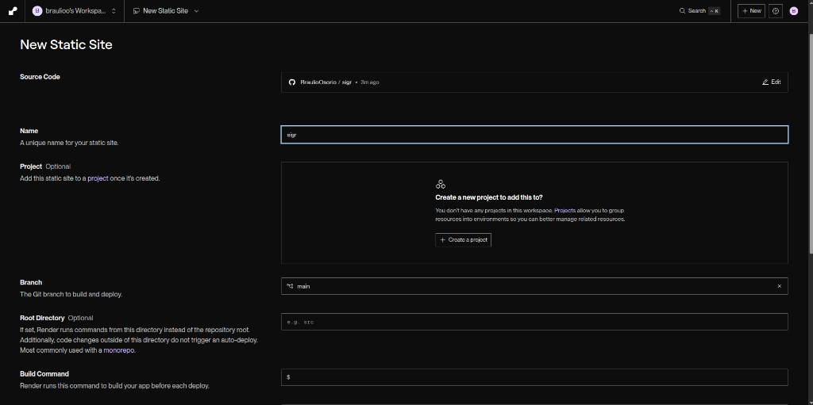
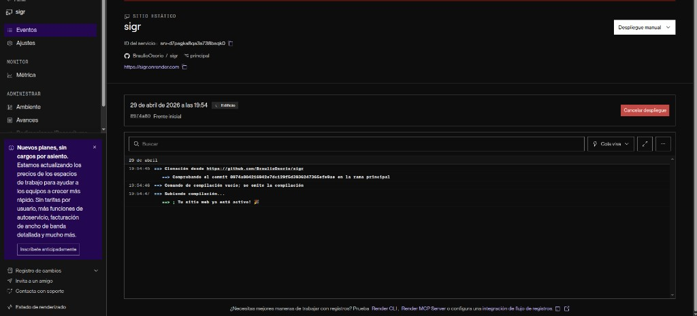

```{=latex}
\begin{titlepage}
\thispagestyle{empty}
\centering
\vspace*{2.8cm}
{\LARGE\bfseries AA2 --- Línea base software de restaurante (SIGR)\par}
\vspace{1.1cm}
{\large Entregable individual\par}
\vspace{2.6cm}
{\large David Alejandro Osorio Martínez\par}
\vspace{0.85cm}
{\normalsize Gestión del software\par}
{\normalsize Ingeniería de software\par}
\vspace{0.5cm}
{\normalsize Unidad 2 --- Gestión de la configuración\par}
\vfill
{\normalsize Tutor: Carlos Carrascal Avendaño\par}
\vspace{0.6cm}
{\normalsize Fecha de entrega: 30/04/2026\par}
\vspace{2.4cm}
\end{titlepage}
\clearpage
```

---

## 2. Introducción

El **Sistema integral de gestión de restaurante (SIGR)** es una aplicación web orientada a la operativa del negocio: pedidos, reservas, menús, usuarios, reportes y facturación. En etapas tempranas del desarrollo, fijar una **línea base** del código fuente permite marcar un hito estable: a partir de ese punto se controlan los cambios, se gana **trazabilidad** y se evita que el producto avance sin un referente claro frente a la asignatura y los siguientes entregables.

---

## 3. Objetivo del taller

Documentar el **primer hito de estabilidad** del SIGR en términos funcionales y técnicos, aplicando **gestión de configuración** y **control de versiones** con Git y GitHub. Se consolida la **documentación técnica** (README, despliegue, datos, changelog) como base para versiones y cambios posteriores.

---

## 4. Contenido técnico

### 4.1. Descripción del proyecto

- **Nombre del sistema:** SIGR — Sistema integral de gestión de restaurante.
- **Descripción breve:** aplicación web para gestionar pedidos, reservas, administración de menús, control de caja y generación de reportes. En esta línea base el **front** implementa los módulos anunciados como **prototipo local** (sin servidor ni base de datos): persistencia únicamente en `localStorage`. Despliegue de demostración: [https://sigr.onrender.com/](https://sigr.onrender.com/).

### 4.2. Componentes incluidos en la línea base

**Implementados en `front/` (JavaScript vanilla, datos en `localStorage`)**

- **Autenticación (demo):** sesión con nombre y rol — *cliente*, *mesero* o *administrador* — sin contraseña ni servidor; sirve para contextualizar el uso del sistema.
- **Menú digital con CRUD:** alta, edición, borrado y categorías de platos; menú semilla restorable; imágenes por URL.
- **Pedidos y seguimiento:** flujo de pedido (carrito, checkout) y vista **Pedidos en vivo** con estados *pendiente → en preparación → listo → entregado*; actualización manual (botón *Actualizar*), sin WebSocket.
- **Reservas:** formulario por fecha, hora y comensales; listado y eliminación local.
- **Cierre de caja y reportes:** total de pedidos confirmados por día calendario; registro de **cierres** como instantáneas en almacenamiento local.

**Pendiente de una fase con backend** *(fuera de este hito)*

- Autenticación segura, menú y pedidos multiusuario, reservas concurrentes, caja auditada en servidor y facturación electrónica.

### 4.3. Versionado del código

- **Herramienta:** Git.
- **Repositorio oficial:** [https://github.com/BraulioOsorio/sigr](https://github.com/BraulioOsorio/sigr).
- **Rama principal estable:** `main`.
- **Commit inicial:** `01e971a72995c86a5dd03305efe145d91d26593f` — *Initial commit*.
- **Documentación e imágenes del taller:** `77c01bcecff75bd7680eed7225e7605866674b06` — *Documentacion inicial*.
- **Front de pedidos y README:** `8974a804216942e7dc129f5d3936247365efe9ae` — *Front inicial*.
- **Documentación AA2 y despliegue:** serie de commits hasta el **HEAD** de `main` en el momento del informe (por ejemplo inclusión de Render y `CHANGELOG`); conviene comprobar con `git log -1 --oneline` en el clon actualizado.

La línea base abarca el historial desde el commit inicial hasta el **HEAD** actual de `main` en GitHub.

#### 4.3.1. Creación del repositorio en GitHub

Se creó el repositorio público **`sigr`** bajo el usuario **BraulioOsorio**, con descripción *Tarea Restaurante*, **README** inicial y licencia **MIT**.



#### 4.3.2. URL HTTPS para clonar

Pestaña *Code*, método **HTTPS**: `https://github.com/BraulioOsorio/sigr.git`.



#### 4.3.3. Clonado en el equipo local

Ejemplo de clonado en el equipo de trabajo (directorio base `~/Oceanic`):

```bash
git clone https://github.com/BraulioOsorio/sigr.git
```



Pasos resumidos: instalar Git → terminal en la carpeta deseada → `git clone` con la URL HTTPS → `cd sigr` → comprobar con `git status` y `git log`.

#### 4.3.4. Registro de cambios en el remoto

Ejemplo de flujo usado al incorporar `docs/` y subir al remoto:

1. `git status` — comprobar rama `main` y archivos sin seguimiento.
2. `git add .` — preparar cambios.
3. `git commit -m "Documentacion inicial"` — commit `77c01bc…` con capturas en `docs/assets/`.
4. `git push` — sincronizar con `origin/main`.

#### 4.3.5. Despliegue público (Render)

Sitio estático con URL: **[https://sigr.onrender.com/](https://sigr.onrender.com/)**

Repositorio: `BraulioOsorio/sigr`, rama `main`. **Root directory:** `front` (para servir `index.html`, `styles.css` y `script.js` en la raíz del sitio).





### 4.4. Criterios para establecer la línea base

- **Front operativo:** el contenido de `front/` se ejecuta en local (p. ej. `python3 -m http.server` dentro de `front/`) y en **producción** en Render, con recorrido manual comprobado: menú, filtros, carrito, checkout y resumen.
- **Compilación / build:** no aplica pipeline de compilación: el entregable es **HTML, CSS y JS estático**; la “compilación” del hito se entiende como conjunto de archivos coherentes y servibles sin errores.
- **Estructura del repositorio:** `docs/` (informe, `DEPLOY`, `DATABASE`, `assets/`), `front/` (aplicación), raíz con `README.md`, `LICENSE`, `LICENSE.txt`, `CHANGELOG.md`.
- **Documentación mínima:** `README.md` (clonar, ejecutar, estructura), `docs/DEPLOY.md` (local y Render), `docs/DATABASE.md` (`localStorage` y modelo futuro), `CHANGELOG.md` (historial hasta la versión documentada).

### 4.5. Herramientas de soporte

- **Git:** control de versiones local; commits y rama `main`.
- **GitHub:** repositorio remoto `BraulioOsorio/sigr`, clonado y `push` documentados.
- **Render:** sitio estático público del front: [https://sigr.onrender.com/](https://sigr.onrender.com/).
- **GitHub Issues:** no activado en este hito; queda disponible para seguimiento de mejoras e incidencias en iteraciones posteriores.
- **Jenkins:** no utilizado en esta línea base *(opcional según guía docente; reservado para integración continua futura)*.

### 4.6. Documentación asociada

- **`README.md`:** incluido — clonado, estructura, ejecución del front, URL Render, créditos de imágenes.
- **`CHANGELOG.md`:** incluido — historial hasta la línea base `0.1.0` y commits relevantes.
- **`LICENSE` y `LICENSE.txt`:** MIT — mismo texto.
- **`docs/DEPLOY.md`:** despliegue local y Render.
- **`docs/DATABASE.md`:** persistencia actual y entidades previstas.

### 4.7. Validación y aprobación de la línea base

La **fecha de creación** de la línea base documentada en este informe es el **30/04/2026**.

El entregable ha sido **validado por** David Alejandro Osorio Martínez. Como **responsable de aprobación** del mismo actúa también David Alejandro Osorio Martínez, en coherencia con la **presentación individual** de la actividad.
